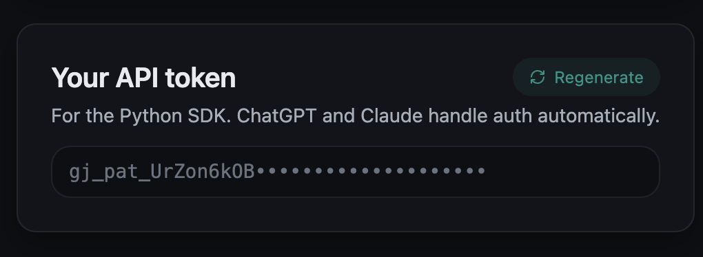
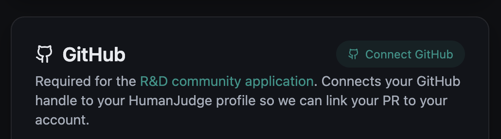

# The challenge

Count how many evaluations exist in any arena on the platform, using the Python SDK. ~15 minutes with basic Python.

## Install the SDK

```bash
pip install grandjury
```

Confirm it imports cleanly:

```python
from grandjury import GrandJury
```

If that runs without error, you're good.

## Create access token (and connect GitHub)

[Create your profile here](https://humanjudge.com/auth?role=builder). On your [profile page](https://humanjudge.com/profile), do both while you're there:

**1. Generate an access token** (click *Regenerate* and copy the `gj_pat_…` string before it's masked):



**2. Click *Connect GitHub*** — this is how we link your PR back to your account later:



Then set the token in your shell:

```bash
export GRANDJURY_API_KEY=<your-token>
```

## Run the challenge

See available arenas:

```python
from grandjury import GrandJury
gj = GrandJury()

for b in gj.benchmarks.list():
    print(b)
```

Pick one, then run:

```python
df = gj.results(evaluation='<arena-slug>')
print(f"Total evaluations: {len(df)}")
```

Note the number, the arena slug, and the timestamp when you ran it.

## Next

Open a PR adding `/challenges/<your-github-handle>.md` — see [TEMPLATE.md](TEMPLATE.md). Full walkthrough in the [main README's "How to apply"](../README.md#how-to-apply).

---

## Going further (optional)

If you want to show more than the minimum, the streams in the [main README](../README.md) sketch what we're working on. The SDK is small — `gj.results()`, `gj.benchmarks`, `gj.models`, and `gj.analytics` are all fair game. Drop any findings in your submission file. Not required for acceptance.
